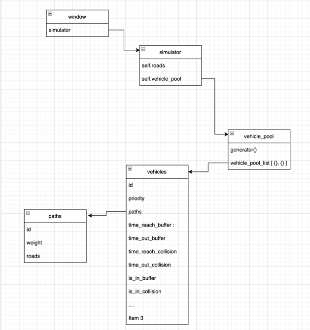

# ChangeLog

### 2022-11-05 by cestoon
1. create vehicle_pool.py to replace vehicle_generator.py to create vehicles and update its position.
2. vehicle no longer belongs to roads. now paths with roads were assigned to vehicle base on weight
3. new structure please check the png

4. simplified the window.py